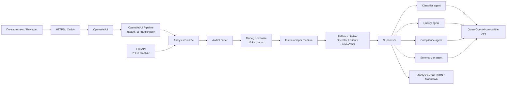

# MTBank AI Transcription

Production-ready прототип речевой аналитики контакт-центра МТБанка: аудио
звонка транскрибируется, размечается по ролям, анализируется набором LLM-агентов
и возвращается в OpenWebUI или через REST API.

Живое демо:

```text
https://165.227.237.72.sslip.io
```

OpenWebUI model:

```text
mtbank_ai_transcription
```

## Что реализовано

- OpenWebUI Pipeline, а не просто FastAPI endpoint.
- REST API `POST /analyze` для файла или публичного URL.
- Единая бизнес-логика `AnalysisService` для API и OpenWebUI Pipeline.
- ASR на `faster-whisper medium` с CPU/GPU-настройками через `.env`.
- Поддержка WAV, MP3, OGG, M4A, FLAC, MP4.
- Базовая диаризация `Оператор` / `Клиент` / `UNKNOWN`.
- Multi-agent анализ из 4 агентов:
  - classifier;
  - quality;
  - compliance;
  - summarizer.
- LLM через Qwen OpenAI-compatible API.
- Pydantic validation и deterministic fallback для каждого агента.
- Prompt layer усилен под белорусский банковский и правовой контекст.
- JSON-логи входа/выхода каждого агента.
- Docker Compose для локального и production-запуска.
- HTTPS-деплой на DigitalOcean через Caddy.
- Тестовые данные, WER/CER, benchmark scripts, unit/integration tests.

## Почему это решение сильнее типового

Типовое решение для такого задания часто ограничивается одним FastAPI endpoint
и демонстрационным prompt. Здесь сделан полноценный контур, близкий к production:

| Зона | Что сделано |
|---|---|
| OpenWebUI | Pipeline реально подключен к OpenWebUI и виден как external model. |
| Архитектура | API и Pipeline используют общий `AnalysisService`, без дублирования логики. |
| Надёжность LLM | Каждый агент валидируется через Pydantic; при ошибке LLM есть fallback. |
| Банковский контекст | Prompts учитывают МТБанк, Халву, Moby, ЕРИП, IBAN, жалобы, ПСК, PIN/CVV/SMS-коды, персональные данные и compliance-risk формулировки. |
| ASR качество | `faster-whisper medium`, WER/CER таблица и тестовые аудио 8 kHz телефонного качества. |
| Demo UX | OpenWebUI transcript-first путь ускоряет пользовательский ответ после загрузки аудио. |
| Observability | JSON-логи пишут `agent_input`, `agent_output`, `agent_error`, `duration_ms`. |
| Deploy | Есть production Compose: наружу смотрит только Caddy HTTPS, API/Pipelines остаются внутренними. |
| Security hygiene | `.env` не коммитится; production `.env` template не содержит секретов; OpenWebUI auth включается в prod. |
| Testing | 75 pytest tests: агенты, схемы, audio loader, ASR wrapper, LLM layer, API, Pipeline, WER utility, logging. |

## Архитектура



### Основной поток REST API

```text
audio file / URL
-> AudioLoader
-> ffmpeg normalize
-> faster-whisper medium
-> fallback diarization
-> 4 LLM agents via Supervisor
-> Pydantic-validated AnalysisResult
```

### Основной поток OpenWebUI

```text
OpenWebUI upload / URL
-> Pipeline extracts audio reference or OpenWebUI transcript sidecar
-> AnalysisService
-> Markdown analysis in chat
```

OpenWebUI имеет дополнительный transcript-first путь: если OpenWebUI уже
подготовил transcript для загруженного файла, Pipeline использует этот текст и
не гоняет ASR повторно. Это улучшает UX живого демо, особенно на CPU-сервере.

## Структура проекта

```text
.
├── app/
│   ├── agents/              # fallback + LLM agents, prompts, telemetry
│   ├── api/v1/              # FastAPI routes
│   ├── asr/                 # faster-whisper wrapper, diarizer
│   ├── audio/               # loading and ffmpeg normalization
│   ├── llm/                 # OpenAI-compatible client
│   ├── orchestration/       # Supervisor
│   ├── config.py            # .env settings
│   ├── logging.py           # JSON logging
│   ├── runtime.py           # full analysis runtime
│   └── service.py           # shared business logic
├── deploy/
│   ├── Caddyfile
│   └── digitalocean.env.example
├── docs/
│   ├── publish-guide.md
│   └── sample-dialog.md
├── scripts/
│   ├── benchmark_suite.py
│   ├── compute_wer.py
│   ├── create_benchmark_media.py
│   ├── generate_test_audio.py
│   └── smoke_openwebui_pipeline.py
├── test_data/
│   ├── *.wav / *.mp3 / *.ogg / *.flac / *.mp4
│   ├── *.txt / *.json
│   ├── manifest.md
│   ├── wer_results.md
│   └── benchmark_results.md
├── tests/
├── Dockerfile
├── docker-compose.yml
├── docker-compose.prod.yml
├── pipeline.py
└── README.md
```

## Технологии

| Область | Реализация |
|---|---|
| AI platform | OpenWebUI Pipelines |
| Backend | Python 3.11, FastAPI |
| ASR | faster-whisper `medium` |
| LLM | Qwen OpenAI-compatible Chat Completions |
| Validation | Pydantic |
| Audio | ffmpeg normalization |
| Deployment | Docker Compose, Caddy HTTPS |
| Tests | pytest, pytest-asyncio, ruff |
| Metrics | WER/CER via jiwer, latency benchmark scripts |

## Конфигурация

Скопировать пример:

```bash
cp .env.example .env
```

Минимальные настройки для локального запуска:

```env
LLM_ENABLED=true
OPENAI_BASE_URL=https://llm-pnv5fw3uqyar1tdu.ap-southeast-1.maas.aliyuncs.com/compatible-mode/v1
OPENAI_API_KEY=<your-key>
OPENAI_MODEL=qwen3.7-plus

WHISPER_MODEL=medium
WHISPER_DEVICE=cpu
WHISPER_COMPUTE_TYPE=int8
WHISPER_BATCH_SIZE=16
WHISPER_LANGUAGE=ru

PIPELINES_API_KEY=<local-secret>
WEBUI_AUTH=False
```

Для production используется отдельный шаблон:

```bash
cp deploy/digitalocean.env.example .env
```

Обязательные production значения:

```env
DOMAIN=<domain-or-ip.sslip.io>
ACME_EMAIL=<email>
OPENAI_API_KEY=<real-key>
PIPELINES_API_KEY=<long-random-secret>
WEBUI_AUTH=True
```

Секрет для Pipelines:

```bash
openssl rand -hex 32
```

## Локальный запуск

Установить зависимости:

```powershell
py -m venv .venv
.venv\Scripts\python.exe -m pip install -r requirements-dev.txt
```

Запустить API:

```powershell
.venv\Scripts\python.exe -m uvicorn main:app --reload
```

Проверить:

```powershell
Invoke-RestMethod http://localhost:8000/health
```

## Docker Compose

Локальный стек:

```bash
docker compose up -d --build
```

Сервисы:

| Service | Purpose | Local URL |
|---|---|---|
| `api` | FastAPI `/analyze` | `http://localhost:8000` |
| `pipelines` | OpenWebUI Pipelines server | `http://localhost:9099` |
| `openwebui` | Chat UI | `http://localhost:3000` |

Проверить модель Pipelines:

```bash
curl -H "Authorization: Bearer $PIPELINES_API_KEY" \
  http://localhost:9099/v1/models
```

## Production HTTPS deploy

Production стек:

```bash
docker compose -f docker-compose.prod.yml up -d --build
```

В production наружу открыты только:

```text
80/tcp
443/tcp
```

`api`, `pipelines`, `openwebui` общаются внутри Docker network. HTTPS и reverse
proxy делает Caddy.

DigitalOcean demo развернут по адресу:

```text
https://165.227.237.72.sslip.io
```

Если нет отдельного домена, можно использовать `sslip.io`:

```text
<DROPLET_IP>.sslip.io
```

## Использование OpenWebUI

1. Открыть HTTPS demo или локальный OpenWebUI.
2. Выбрать модель `mtbank_ai_transcription`.
3. Загрузить WAV/MP3/OGG/FLAC/MP4 через чат.
4. Дождаться обработки файла OpenWebUI.
5. Отправить:

```text
Проанализируй загруженный звонок
```

Для URL:

```text
Проанализируй звонок по ссылке: https://example.com/call.wav
```

URL должен быть прямой публичной ссылкой на аудиофайл, без логина и HTML
preview-страницы.

## REST API

### Upload файла

```bash
curl -X POST http://localhost:8000/analyze \
  -F "file=@test_data/call01_credit_online.wav"
```

### Анализ URL

```bash
curl -X POST http://localhost:8000/analyze \
  -H "Content-Type: application/json" \
  -d '{"url":"https://example.com/call01_credit_online.wav"}'
```

### Формат ответа

```json
{
  "transcript": [
    {
      "speaker": "Оператор",
      "start": 0.0,
      "end": 4.2,
      "text": "Добрый день, МТБанк, меня зовут Анна."
    }
  ],
  "classification": {
    "topic": "кредиты",
    "priority": "medium",
    "confidence": 0.9,
    "confidence_label": "high",
    "rationale": "..."
  },
  "quality_score": {
    "total": 78,
    "checklist": {
      "greeting": true,
      "need_detection": true,
      "solution_provided": true,
      "farewell": false
    },
    "comments": []
  },
  "compliance": {
    "passed": true,
    "issues": []
  },
  "summary": "Клиент обратился по вопросу...",
  "action_items": ["Отправить инструкцию клиенту"],
  "metadata": {}
}
```

## Multi-Agent логика

| Агент | Выход | Что проверяет |
|---|---|---|
| Classifier | `Classification` | тема, приоритет, confidence, rationale |
| Quality | `QualityScore` | приветствие, представление, выявление потребности, решение, возражения, прощание |
| Compliance | `ComplianceResult` | запрещенные обещания, PIN/CVV/SMS, банковская тайна, персональные данные, жалобы |
| Summarizer | `SummaryResult` | резюме 3-5 предложений и action items |

Почему собственный Supervisor, а не LangGraph:

- для 4 независимых агентов достаточно простого `asyncio.gather`;
- меньше runtime-зависимостей и ниже риск на demo;
- Pydantic-контракты уже обеспечивают строгую границу между агентами;
- проще тестировать: каждый агент мокается и проверяется отдельно.

Если LLM недоступен или возвращает невалидный JSON, конкретный агент уходит в
deterministic fallback. Остальные агенты продолжают работать.

## Логирование

Формат по умолчанию:

```env
LOG_FORMAT=json
```

Каждый агент пишет:

```json
{
  "event": "agent_input",
  "agent": "classifier",
  "agent_input": {
    "segment_count": 3,
    "total_text_chars": 902,
    "segments": []
  }
}
```

```json
{
  "event": "agent_output",
  "agent": "classifier",
  "duration_ms": 5432.92,
  "agent_output": {
    "mode": "llm",
    "result": {
      "topic": "кредиты",
      "priority": "medium"
    }
  }
}
```

Ошибки пишутся как `agent_error` с exception payload.

## Тестовые данные

Подготовлены 6 исходных аудиофайлов и 1 benchmark MP4:

| Файл | Длительность | Формат | Тема | Особенность |
|---|---:|---|---|---|
| `call01_credit_online.wav` | 91.83s | WAV 8 kHz | кредиты | нормальный качественный звонок |
| `call02_halva_fraud.mp3` | 98.72s | MP3 8 kHz | жалобы | Халва, fraud-risk, блокировка |
| `call03_transfer_stuck.ogg` | 97.87s | OGG 8 kHz | переводы | IBAN, реквизиты, задержка платежа |
| `call04_compliance_risky.wav` | 63.79s | WAV 8 kHz | кредиты | рискованные обещания оператора |
| `call05_poor_quality_complaint.mp3` | 62.88s | MP3 8 kHz | жалобы | плохое качество консультации |
| `call06_unknown_nonsense.flac` | 45.76s | FLAC 8 kHz | другое | бессмысленный разговор / UNKNOWN |
| `benchmark_5min_call.mp4` | 300.00s | MP4 | mixed | 5-минутный latency benchmark |

Общая длительность исходных тестовых звонков: 460.85s, то есть 7.68 минут.

## WER/CER

Команда:

```bash
python scripts/compute_wer.py
```

Результаты сохранены в:

```text
test_data/wer_results.md
test_data/wer_results.json
```

Профиль измерения:

```text
Machine: local laptop
ASR: faster-whisper medium
Device: CPU
Compute type: int8
Batch size: 16
```

| Файл | Длительность | WER | CER | ASR latency |
|---|---:|---:|---:|---:|
| `call01_credit_online.wav` | 91.83s | 0.039 | 0.014 | 36.28s |
| `call02_halva_fraud.mp3` | 98.72s | 0.035 | 0.008 | 27.71s |
| `call03_transfer_stuck.ogg` | 97.87s | 0.079 | 0.027 | 28.33s |
| `call04_compliance_risky.wav` | 63.79s | 0.022 | 0.002 | 19.48s |
| `call05_poor_quality_complaint.mp3` | 62.88s | 0.041 | 0.029 | 17.58s |
| `call06_unknown_nonsense.flac` | 45.76s | 0.000 | 0.000 | 18.54s |

Итог:

```text
Mean WER: 0.036
Mean CER: 0.013
ASR realtime factor: 0.32x
```

## Benchmark

Команда для полного REST API benchmark:

```bash
python scripts/benchmark_suite.py --url http://127.0.0.1:8000/analyze --clear-output
```

### Локальный ноутбук, full `/analyze`

Этот benchmark измеряет полный путь:

```text
upload -> normalize -> faster-whisper medium -> diarization -> 4 LLM agents
```

| Файл | Длительность | Latency | RTF | HTTP | Topic | Quality | Compliance |
|---|---:|---:|---:|---:|---|---:|---|
| `call01_credit_online.wav` | 91.83s | 35.70s | 0.39 | 200 | кредиты | 100 | true |
| `call02_halva_fraud.mp3` | 98.72s | 34.47s | 0.35 | 200 | жалобы | 100 | true |
| `call03_transfer_stuck.ogg` | 97.87s | 36.14s | 0.37 | 200 | переводы | 60 | true |
| `call04_compliance_risky.wav` | 63.79s | 34.63s | 0.54 | 200 | кредиты | 30 | false |
| `call05_poor_quality_complaint.mp3` | 62.88s | 25.65s | 0.41 | 200 | жалобы | 0 | false |
| `call06_unknown_nonsense.flac` | 45.76s | 24.26s | 0.53 | 200 | другое | 0 | true |
| `benchmark_5min_call.mp4` | 300.00s | 78.75s | 0.26 | 200 | жалобы | 100 | true |

Итог локального full-ASR benchmark:

```text
Successful files: 7/7
Total media duration: 760.85s
Total wall-clock latency: 269.60s
Mean latency: 38.51s
Overall realtime factor: 0.35x
```

### DigitalOcean demo, OpenWebUI transcript-first

Этот путь измеряет пользовательский demo UX после того, как OpenWebUI уже
подготовил transcript для загруженного файла. Это не полный ASR benchmark, а
скорость ответа Pipeline/LLM в OpenWebUI после обработки upload.

| Конфигурация | Сценарий | Файл | Размер | Наблюдаемая latency |
|---|---|---|---:|---:|
| DigitalOcean 4 Intel vCPU / 8 GB RAM | OpenWebUI transcript-first | 5-минутный MP4 | 1.6 MB | 1.55s |
| DigitalOcean 4 Intel vCPU / 8 GB RAM | OpenWebUI / short call demo | короткие звонки | до 1 MB | около 30s |

Разница между таблицами важна:

- full `/analyze` показывает полный путь с нашим `faster-whisper medium`;
- OpenWebUI transcript-first показывает UX демо, где ASR уже выполнен на этапе
  загрузки файла в OpenWebUI.

## Проверки качества

```bash
python -m pytest
python -m ruff check .
docker compose -f docker-compose.prod.yml config --quiet
```

Последняя локальная проверка:

```text
75 passed, 1 skipped
All checks passed
```

## Production hardening

- `WEBUI_AUTH=True` в production.
- Caddy выпускает HTTPS certificate автоматически.
- API и Pipelines не публикуются наружу в `docker-compose.prod.yml`.
- `.env` исключён из git.
- Production env template не содержит секретов.
- `PIPELINES_API_KEY` обязателен.
- OpenWebUI data, Caddy data, audio storage и whisper cache вынесены в Docker volumes.

## Ограничения

- Диаризация fallback, не pyannote. Для тестового задания это закрывает базовое
  требование, но не претендует на production-grade speaker diarization.
- CPU-only full ASR на 5-минутном файле может быть дольше 60 секунд.
- OpenWebUI transcript-first ускоряет demo UX, но не заменяет full ASR benchmark.
- 5-минутный MP4 является синтетической склейкой нескольких звонков, поэтому
  итоговая тема выбирается по наиболее рискованному фрагменту.

## Команды обслуживания на сервере

```bash
docker compose -f docker-compose.prod.yml ps
docker compose -f docker-compose.prod.yml logs -f caddy
docker compose -f docker-compose.prod.yml logs -f openwebui
docker compose -f docker-compose.prod.yml logs -f pipelines
docker compose -f docker-compose.prod.yml logs -f api
```

Обновить:

```bash
git pull
docker compose -f docker-compose.prod.yml up -d --build
```

Остановить:

```bash
docker compose -f docker-compose.prod.yml down
```

## Что отправлять на сдачу

- GitHub repository URL.
- HTTPS demo URL:

```text
https://165.227.237.72.sslip.io
```

- Краткое описание архитектуры:

```text
Решение построено вокруг общего AnalysisService, который используется и FastAPI
/analyze, и OpenWebUI Pipeline. Аудио нормализуется через ffmpeg,
транскрибируется faster-whisper medium, размечается fallback diarizer, после
чего четыре LLM-агента на Qwen OpenAI-compatible API выполняют классификацию,
оценку качества, compliance-анализ и суммаризацию. Все ответы валидируются
Pydantic-моделями, каждый агент имеет deterministic fallback, а production demo
развернуто на DigitalOcean через Docker Compose и Caddy HTTPS.
```
